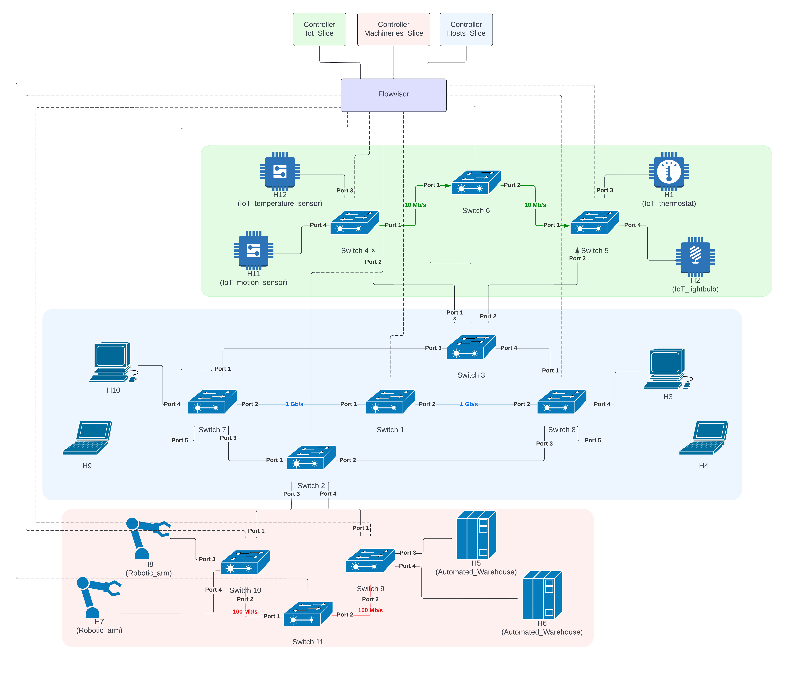

# Connecting SDN Slices in ComNetsEmu
Software developed as part of the exam:

*Softwarized and Virtualized Mobile Networks A.Y. 2021/2022 - UniTN*


**Riccardo Bussola** - _Mat. 209202_  
**Federico Montagna** - _Mat. 209100_  
**Alice Fasoli** - _Mat. 209205_


## Table of Contents

- [Building Blocks](#building-blocks)
- [Implementation](#implementation)
  * [Integrating FlowVisor in ComNetsEmu](#integrating-flowvisor-in-comnetsemu)
- [Topology](#topology)
- [Demo](#demo)
  * [Setting up the topology (Mininet)](#setting-up-the-topology-mininet)
  * [Setting up the core controller (FlowVisor)](#setting-up-the-core-controller-flowvisor)
  * [Setting up the tenant controllers (RYU)](#setting-up-the-tenant-controllers-ryu)
  * [IoT slice demonstration](#iot-slice-demonstration)
  * [Machineries slice demonstration](#machineries-slice-demonstration)
  * [Hosts slice demonstration](#hosts-slice-demonstration)
- [Known Issue](#known-issue)


## Building Blocks

- **Open vSwitch (v2.7)**: open-source multi-layer virtual switch manager that allows the communication between "dumb switches" and controllers.
- **RYU (v4.34)**: component-based Software Defined Networking framework implemented in Python that provides a simple way to define control functionalities for an OpenFlow controller. 
- **FlowVisor (v1.4)**: special purpose OpenFlow controller that acts as a transparent proxy between OpenFlow switches and multiple OpenFlow controllers.


## Implementation


- **Topology** (hosts and switches): defined in ComNetsEmu.
- **FlowVisor** (core controller): stands in between the switches and the tenant controllers; defines the slices to which one RYU controller is assigned each (enabling multi-tenancy); policy checks each OpenFlow message that goes through it, checking permissions related to the policies defined.
- **RYU controllers** (tenant controllers): defined in ComNetsEmu.

*Note 1*: FlowVisor v1.4 (last open-source version available) is based on OpenFlow 1.0, thus both the Open vSwitch switches and the RYU controllers need to be set up working with OpenFlow 1.0.

*Note 2*: [RYU git repository](https://github.com/faucetsdn/ryu) must be cloned in comnetsemu_dependencies and installed via
```bash
vagrant@comnetsemu:~/comnetsemu_dependencies/ryu $ sudo python3 setup.py install
```

### Integrating FlowVisor in ComNetsEmu

Since FlowVisor is quite old and outdated, it needs to be implemented in a Docker container running an old CentOS image with an old version of Java (required by FlowVisor).


## Topology



The topology presents 3 slices (topology slicing):
- **IoT**: tenant controller forwards UDP traffic on port 1883 based on direction (left-to-right, via Switch 6) and from hosts slice via switch 3. Connection between switch 4 and switch 3 is disabled and present only for future implementations.
- **Machineries**: tenant controller forwards traffic between same slice via switch 11 and to hosts slice via switch 9 and 10.
- **Hosts**: tenant controller forwards TCP traffic on port 9999 between same slice via switch 1, to iot slice from switch 3 and to hosts slice via switch 2.

## Demo
Start up ComNetsEmu VM `vagrant up comnetsemu` and log into it `vagrant ssh comnetsemu`.

### Setting up the core controller (FlowVisor)

In a new terminal.

The first time, build the FlowVisor image:
```bash
vagrant@comnetsemu:~/comnetsemu/app/networking2_network_slicing $ ./clean.sh  # To flush any previous configurations
vagrant@comnetsemu:~/comnetsemu/app/networking2_network_slicing $ cd flowvisor/
vagrant@comnetsemu:~/comnetsemu/app/networking2_network_slicing/flowvisor $ ./build_flowvisor_image.sh
```

Run the Flowvisor container:
```bash
vagrant@comnetsemu:~/comnetsemu/app/networking2_network_slicing/flowvisor $ ./run_flowvisor_container.sh
```

*Note*: Please verify that the directory in the file above points to the correct folder using the absolute path. Otherwise, the folder below will be empty.

```bash
[root@comnetsemu /] cd
[root@comnetsemu ~] cd slicing_scripts
[root@comnetsemu slicing_scripts] ./flowvisor_slicing.sh  # Press ENTER when a slice password is required (empty password)
```

### Setting up the topology (Mininet)

Set up the topology with Mininet:
```bash
vagrant@comnetsemu:~/comnetsemu/app/networking2_network_slicing $ sudo -E python3 topology.py
```

### Setting up the tenant controllers (RYU)

Open a new terminal for each controller.

IoT slice controller:
```bash
vagrant@comnetsemu:~/comnetsemu/app/networking2_network_slicing $ ryu run --observe-links --ofp-tcp-listen-port 10001 --wsapi-port 8082 /home/vagrant/comnetsemu_dependencies/ryu/ryu/app/gui_topology/gui_topology.py ryu-iot.py
```

Machineries slice controller:
```bash
vagrant@comnetsemu:~/comnetsemu/app/networking2_network_slicing $ ryu run --observe-links --ofp-tcp-listen-port 10002 --wsapi-port 8083 /home/vagrant/comnetsemu_dependencies/ryu/ryu/app/gui_topology/gui_topology.py ryu-machineries.py
```

Hosts slice controller:
```bash
vagrant@comnetsemu:~/comnetsemu/app/networking2_network_slicing $ ryu run --observe-links --ofp-tcp-listen-port 10003 --wsapi-port 8084 /home/vagrant/comnetsemu_dependencies/ryu/ryu/app/gui_topology/gui_topology.py ryu-hosts.py
```

Check the status of each slice infrastructure (as seen by each tenant controller) on your browser:
- IoT slice: [0.0.0.0:8082](http://0.0.0.0:8082)
- Machineries slice: [0.0.0.0:8083](http://0.0.0.0:8083)
- Hosts slice: [0.0.0.0:8084](http://0.0.0.0:8084)

## Testing reachability

### Network connection

Verify the hosts reachability by executing the pingall command in mininet:
```bash
mininet> pingall
```

The result should be like this:
```
*** Ping: testing ping reachability
h1 -> X X X X X X X X X X X
h2 -> X X X X X X X X X X X
h3 -> X X h4 X X X X h9 h10 X X
h4 -> X X h3 X X X X h9 h10 X X
h5 -> X X X X X X X X X X X
h6 -> X X X X X X X X X X X
h7 -> X X X X X X X X X X X
h8 -> X X X X X X X X X X X
h9 -> X X h3 h4 X X X X h10 X X
h10 -> X X h3 h4 X X X X h9 X X
h11 -> X X X X X X X X X X X
h12 -> X X X X X X X X X X X
*** Results: 90% dropped (12/132 received) 
```
*Note:* The hosts in the Iot and in the Machineries slices cannot ping the others hosts in the same slice (or the one in the Hosts slice) because the ping are ICMP packets and not UDP or TCP.

### IoT slice demonstration

Verify that UDP traffic on port 1883 is handled by iot tenant controller via Switch 6.

**For h1 - h12 hosts:**

Open an X terminal for Host 1 and Host 12:
```bash
mininet> xterm h1
mininet> xterm h12
```

Run an iperf server and client connection, on Host 1 and Host 12 respectively:
```bash
xterm-h1> iperf -s -u -p 1883  # UDP iperf server on port 1883
xterm-h12> iperf -c 10.0.0.1 -u -p 1883 -t 10 -i 1  # UDP iperf client on port 1883
```

**For h2 - h11 hosts:**

Open an X terminal for Host 2 and Host 11:
```bash
mininet> xterm h2
mininet> xterm h11
```

Run an iperf server and client connection, on Host 2 and Host 11 respectively:
```bash
xterm-h2> iperf -s -u -p 1883  # UDP iperf server on port 1883
xterm-h11> iperf -c 10.0.0.2 -u -p 1883 -t 10 -i 1  # UDP iperf client on port 1883
```

Check flows inserted in Switch 4, Switch 6 and Switch 5 (to do while running iperf):
```bash
sudo ovs-ofctl dump-flows s4
sudo ovs-ofctl dump-flows s6
sudo ovs-ofctl dump-flows s5
```

### Machineries slice demonstration

Verify that TCP traffic on port 9999 is handled by machineries tenant controller via Switch 11.

Open an X terminal for Host 5 and Host 7:
```bash
mininet> xterm h5
mininet> xterm h7
```

Run an iperf server and client connection, on Host 5 and Host 7 respectively:
```bash
xterm-h5> iperf -s -p 9999  # TCP iperf server on port 9999
xterm-h7> iperf -c 10.0.0.5 -p 9999 -t 10 -i 1  # TCP iperf client on port 9999
```

Check flows inserted in Switch 9, Switch 11 and Switch 10 (to do while running iperf):
```bash
sudo ovs-ofctl dump-flows s9
sudo ovs-ofctl dump-flows s11
sudo ovs-ofctl dump-flows s10
```

> It is possible to connect every host in this slice (h5, h6, h7, h8)

### Hosts slice demonstration

Verify that other traffic is handled by hosts tenant controller via Switch 1.

Run an iperf server and client connection, on Host 10 and Host 3 respectively:
```bash
mininet> iperf h10 h3
```

Check flows inserted in Switch 7, Switch 1 and Switch 8 (to do while running iperf):
```bash
sudo ovs-ofctl dump-flows s7
sudo ovs-ofctl dump-flows s1
sudo ovs-ofctl dump-flows s8
```

> It is possible to connect every host in this slice (h3, h4, h9, h10)

### Hosts - Iot slice connection demonstration

Verify that UDP traffic on port 1883 from hosts slice to iot slice is handled by hosts tenant controller via Switch 3.

Use the X terminal for Host 10 and Host 1 previously spawned. In case they have been exited, respawn them:
```bash
mininet> xterm h10 
mininet> xterm h1
```

Run an iperf server and client connection, on Host 1 and Host 10 respectively:
```bash
xterm-h1> iperf -s -u -p 1883  # UDP iperf server on port 1883
xterm-h10> iperf -c 10.0.0.1 -u -p 1883 -t 10 -i 1  # UDP iperf client on port 1883
```

Check flows inserted in Switch 7, Switch 3 and Switch 5 (to do while running iperf):
```bash
sudo ovs-ofctl dump-flows s7
sudo ovs-ofctl dump-flows s3
sudo ovs-ofctl dump-flows s5
```

> It is possible to connect every host in the hosts slice (h3, h4, h9, h10) with hosts h1 and h2 from iot slice

### Hosts - Machineries slice connection demonstration

Verify that TCP traffic on port 9999 from hosts slice to machineries slice and vice versa is handled by hosts tenant controller via Switch 2.

Use the X terminal for Host 10 and Host 7 previously spawned. In case they have been exited, respawn them:
```bash
mininet> xterm h10
mininet> xterm h7
```

Run an iperf server and client connection, on Host 7 and Host 10 respectively:
```bash
xterm-h7> iperf -s -p 9999  # TCP iperf server on port 9999
xterm-h10> iperf -c 10.0.0.7 -u -p 9999 -t 10 -i 1  # TCP iperf client on port 9999
```

Check flows inserted in Switch 7, Switch 2 and Switch 9 (to do while running iperf):
```bash
sudo ovs-ofctl dump-flows s7
sudo ovs-ofctl dump-flows s2
sudo ovs-ofctl dump-flows s9
```

> It is possible to connect every host in the hosts slice (h3, h4, h9, h10) with every hosts from machineries slice (h5, h6, h7, h8)

**IMPORTANT:** When exiting the scenario it is strongly recommended to flush everything with the command `sudo mn -c` or `./clean.sh`.

## Known Issue

An issue was found during the project. It is related to the ryu package. This kind of error takes place only when a packet are forwarded from a slice to another.

As an example, this issue may arise in the topology exposed, from the handling by the middle slice tenant controller to command a packet_out message to Switch 4 (which is shared with the upper slice). That would generate an error, illustrated below, of type "bad permissions" on the switch.

```bash
> File
> "/usr/local/lib/python2.7/dist-packages/ryu/controller/ofp_handler.py",
> line 281, in error_msg_handler
>     if msg.type == ofp.OFPET_EXPERIMENTER:
> AttributeError: 'module' object has no attribute 'OFPET_EXPERIMENTER'
```

We found a workaround to prevent this error following the instructions [here](https://sourceforge.net/p/ryu/mailman/message/36498151/).
We changed the line 281 as follows:
```
-        if msg.type == ofp.OFPET_EXPERIMENTER:
+        if ofp.OFP_VERSION > 0x01 and msg.type == ofp.OFPET_EXPERIMENTER:
```
and then we rebuilt the ryu package as follows:
```bash
vagrant@comnetsemu:~/comnetsemu_dependencies/ryu $ pip install .
```